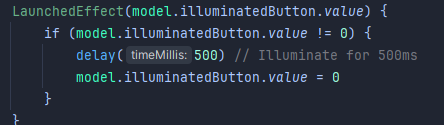
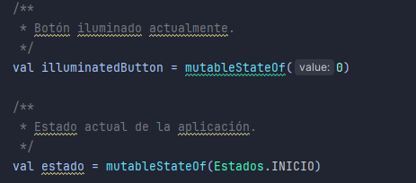
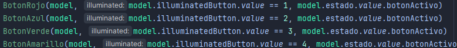

# **Simon Dice - Juego Interactivo en Android con MVVM**

Este proyecto es una implementación de un juego interactivo *Simon Dice* utilizando Kotlin y Jetpack Compose, siguiendo el patrón de arquitectura **MVVM**.

---

## **Índice**

1. [Descripción del Proyecto](#descripción-del-proyecto)
2. [Estructura del Proyecto](#estructura-del-proyecto)
   - [Funcionalidad MVVM](#1-funcionalidad-mvvm)
   - [Corutinas en Jetpack Compose y ViewModel](#2-corutinas-en-jetpack-compose-y-viewmodel)
   - [Patrón Observer](#3-patrón-observer)
---

## **1. Descripción del Proyecto**

Este proyecto es un juego interactivo basado en simon dice en el que tienes que pulsar el boton correcto, si lo haces bien se pasa de ronda sino el juego se reinicia

---

## **2. Estructura del Proyecto**

### **2.1 Funcionalidad MVVM**

El proyecto implementa el patrón **MVVM** dividiendo la lógica en tres capas principales:

- **Modelo (Data)**
  - Se encarga de almacenar los datos compartidos del juego.
  - Variables clave:
    - `numeroSecuencia`: Número generado aleatoriamente para la secuencia.
    - `numeroUsuario`: Entrada del usuario.
    - `puntuacion`: Puntuación actual del jugador, gestionada como un estado observable (`mutableStateOf`).

- **Vista (UI)**
  - Contiene los elementos gráficos del juego, diseñados como *composables*:
    - Botones interactivos: `BotonRojo`, `BotonAzul`, `BotonVerde`, `BotonAmarillo`.
    - Control de inicio: `BotonStart`.
    - Visualización de la puntuación: `Puntuacion`.
    - Fondo: `BackgroundImage`.

- **ViewModel**
  - Gestiona la lógica del proyecto y las interacciones entre el modelo y la vista:
    - `numeroAleatorio`: Genera números aleatorios para la secuencia.
    - `comparar`: Verifica si la entrada del usuario coincide con la secuencia generada.

---

### **2.2 Corutinas en Jetpack Compose y ViewModel**

El proyecto utiliza **corutinas** para gestionar tareas temporales sin bloquear el flujo principal como iluminar el boton que se debe pulsar:

---

### **2.3 Patrón Observer**

El proyecto utiliza el patrón Observer mediante el uso de mutableStateOf y recomposiciones automáticas de Jetpack Compose:

- En la `ViewModel`, se gestionan estados observables como `illuminatedButton` y `estados`:

- Estos estados son observados en la `UI`, asegurando que los cambios en el modelo se reflejen automáticamente en la vista:

